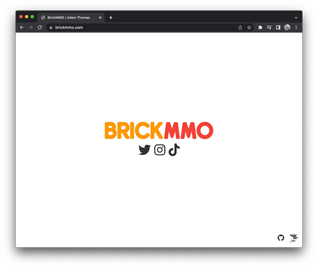

# BrickMMO Splash Page

A basic splash page for the [BrickMMO Smart City](https://brickmmo.com).

---

## Project Stack

This project uses [HTML](https://developer.mozilla.org/en-US/docs/Web/HTML) and [CSS](https://developer.mozilla.org/en-US/docs/Web/CSS).

 

---

## Repository Resources

* [BrickMMO](https://brickmmo.com)
* [CodeAdam](https://codeadam.ca)

